**1. UPGRADING THE MAIN CHARACTER.**  
Проект гибридной игры, сочетающей жанры survival, tower defense и RPG. Игроку предстоит пройти путь от выживания к господству через развитие базы, освоение ремесел и победу над мощными боссами.

  
  
  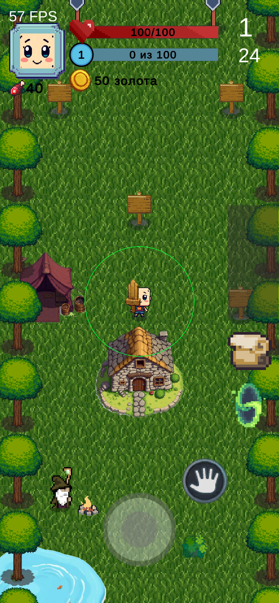
  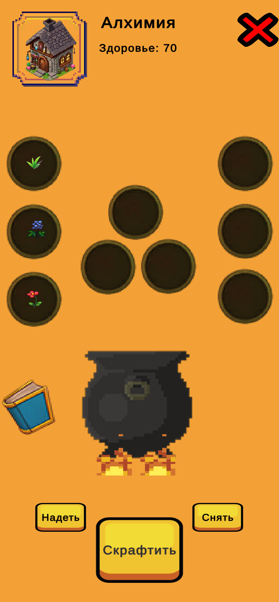 
  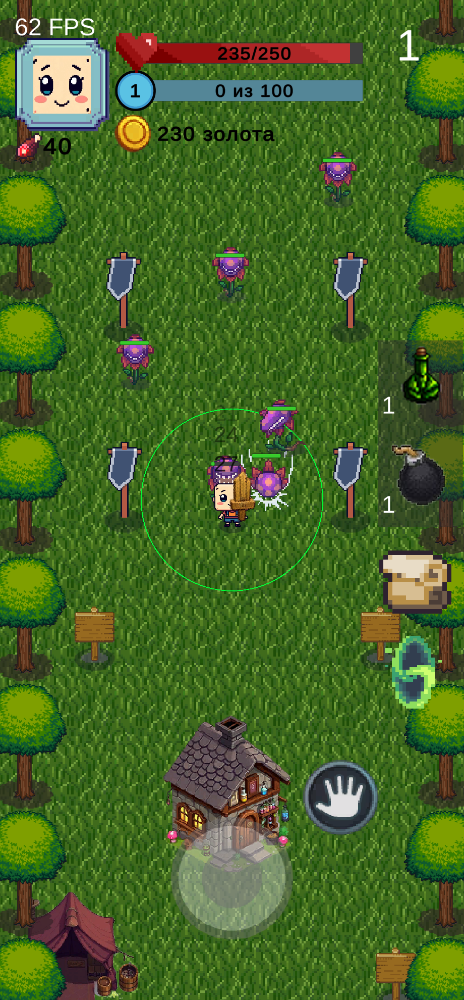
  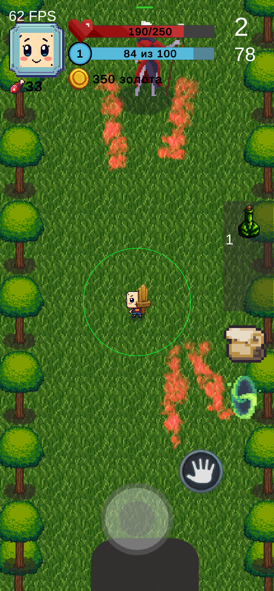
  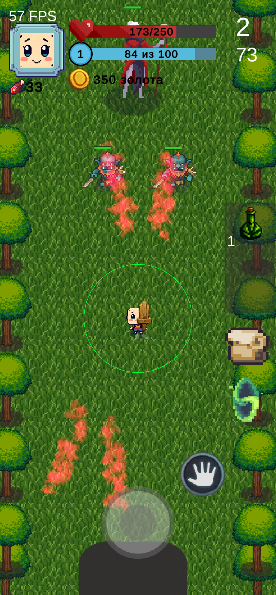
  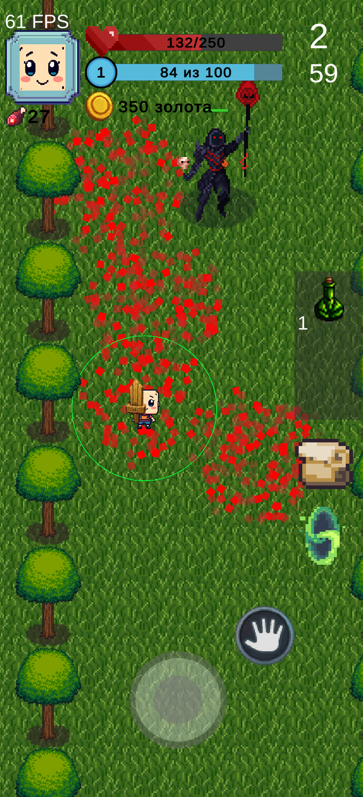

  

**2. SLIMEGUN CHRONICLES.**  
Напряжённый 2D-шутер с видом сверху, где вам предстоит выживать на одном уровне, сражаясь с волнами врагов. Уменьшите распространение оружия, адаптируйтесь к трем уровням сложности и проявите мастерство в битвах. Вас ждут динамичные установки. 

  
  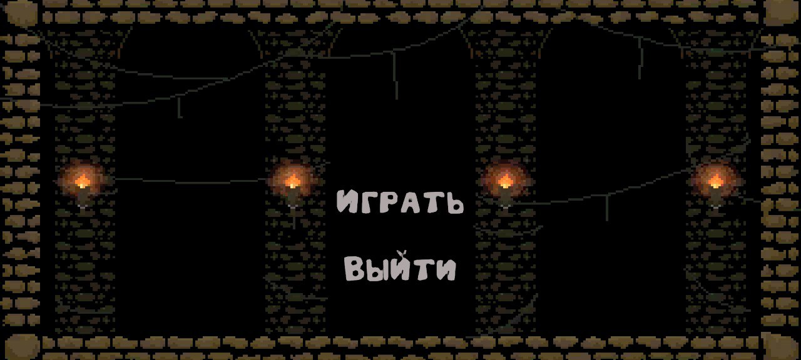
  
  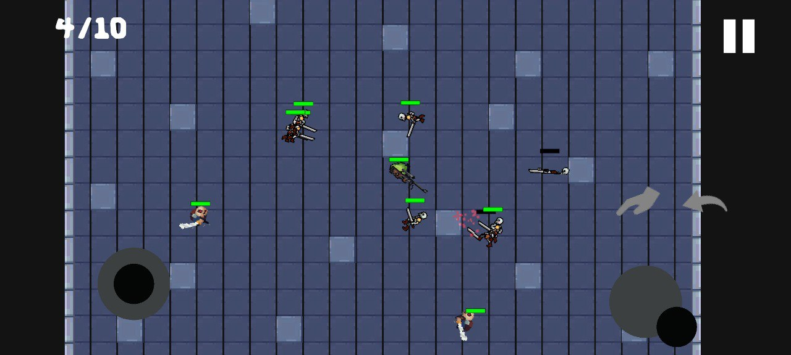 
  

  

**3. SLIDE CUP.**  
Динамичная аркада с прогрессирующей сложностью. Игроку необходимо прицеливаться и с силой запускать снаряд, чтобы поразить все мишени на уровне. Уникальный геймплей с механикой управления силой броска: зажатие на экране и свайп для точного расчета траектории. С каждым уровнем задачи становятся все сложнее, требуя от игрока ювелирной точности и стратегического мышления.

  
  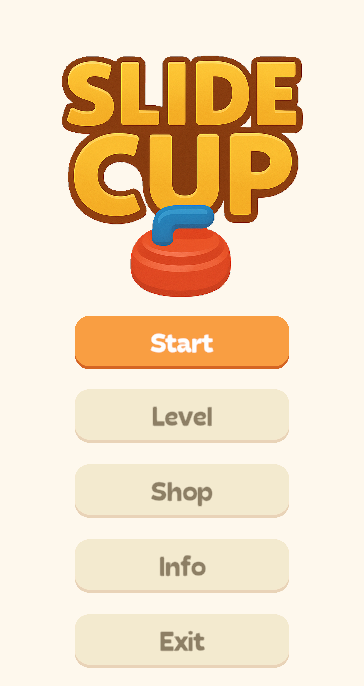
  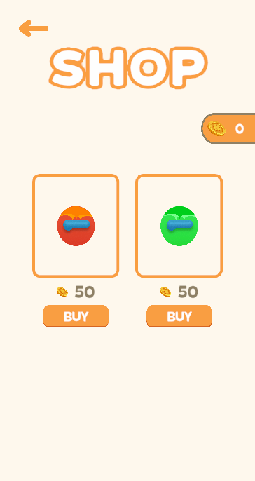
  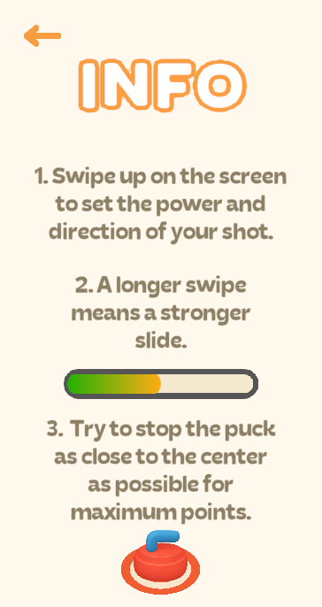 
  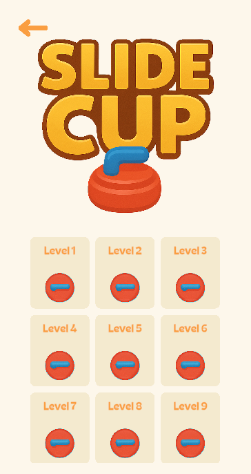
  
   

